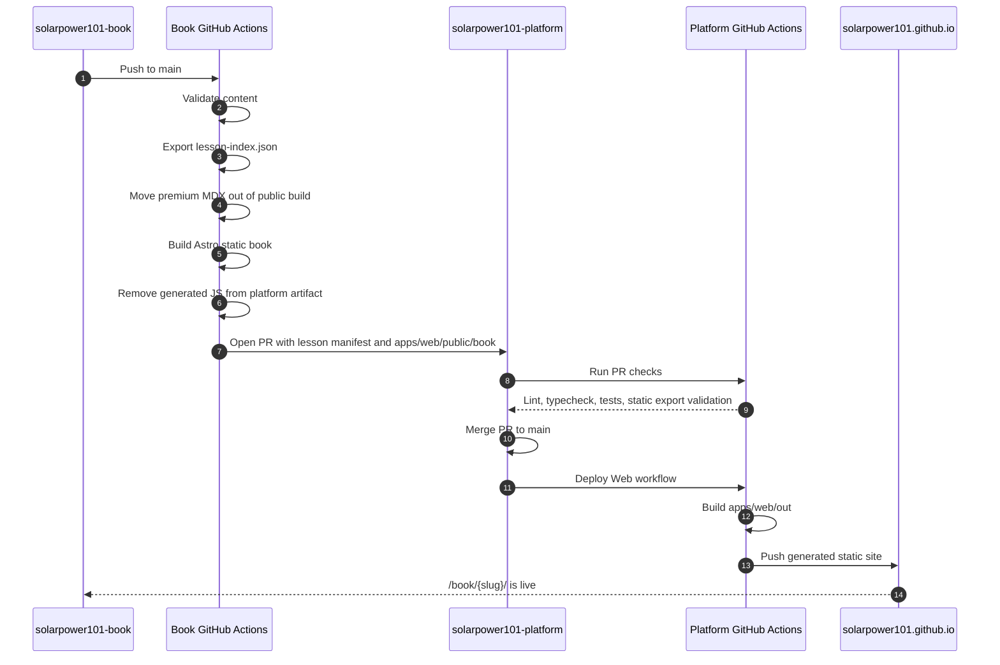

# SolarPower101 Book

Public educational source content for SolarPower101 Academy.

This repository is the canonical source for the SolarPower101 learning product. It owns long-form chapters, free/premium access metadata, and future book-specific assets such as animations, visualizations, and video tutorial metadata.

The platform learn route at:

```txt
https://solarpower101.github.io/learn/
```

uses this repo through an exported manifest. The platform should treat `/learn/` as a catalog, preview, and conversion surface. The canonical chapter experience belongs to this book repo.

## Current Commands

```sh
npm run validate
npm run export:public-index
npm run build
```

`npm run export:public-index` writes `src/data/lesson-index.json`.
`npm run build` writes the static book site to `dist/`. The site is configured with `base: "/book"` so the generated pages are intended to be served by the platform at `https://solarpower101.github.io/book/`.

## Integration Contract

Every public lesson exports:

- matching `slug` frontmatter
- `access: free`
- `category`
- `summary`
- `last_verified_at`
- a stable platform URL: `https://solarpower101.github.io/learn/{slug}/`
- a book URL path: `/book/{slug}/`

The exported manifest is the only data the platform should consume directly. Full MDX chapters, animations, visualizations, and video metadata should stay in this repository unless they are intentionally exposed through a versioned manifest.

## GitHub Sync

This repository syncs its public lesson manifest and built public book pages into `solarpower101-platform` with GitHub Actions:

```txt
solarpower101-book
  -> validate, export src/data/lesson-index.json, and build dist/
  -> temporarily remove premium MDX before the public static build
  -> remove generated client-side JS from the platform copy
  -> open a PR against solarpower101-platform
  -> platform PR checks verify the generated data
  -> platform deploy publishes solarpower101.github.io/book/
```



Required GitHub Actions configuration for this repo:

| Name | Type | Value |
| --- | --- | --- |
| `PLATFORM_REPOSITORY` | variable | `solarpower101/solarpower101-platform` |
| `PLATFORM_LESSON_INDEX_PATH` | variable | `packages/domain/src/generated/solar-power-101.lesson-index.json` |
| `PLATFORM_BOOK_OUTPUT_PATH` | variable | `apps/web/public/book` |
| `PLATFORM_REPO_TOKEN` | secret | fine-grained personal access token that grants this workflow write access to `solarpower101-platform` |

The workflow also has defaults for the variables, but setting them in GitHub keeps the destination explicit.

Configure the variables with `gh`:

```sh
gh variable set PLATFORM_REPOSITORY --body solarpower101/solarpower101-platform
gh variable set PLATFORM_LESSON_INDEX_PATH --body packages/domain/src/generated/solar-power-101.lesson-index.json
gh variable set PLATFORM_BOOK_OUTPUT_PATH --body apps/web/public/book
```

Configure the secret with a token value:

```sh
gh secret set PLATFORM_REPO_TOKEN
```

`PLATFORM_REPO_TOKEN` is stored as a secret in this `solarpower101-book` repository because the sync workflow runs here. Its value is a GitHub fine-grained personal access token, usually named something like `solarpower101-book-to-platform-sync`, scoped to the `solarpower101-platform` repository with:

- `Contents: Read and write`
- `Pull requests: Read and write`

The token lets the workflow check out `solarpower101-platform`, create a sync branch, commit the generated lesson manifest and public book build, push the branch, and open a pull request.
The same workflow also replaces the configured platform book output directory with this repo's public-only `dist/` contents. The default assumes the platform deploys the Next.js app in `apps/web`, so `apps/web/public/book` is copied into the static export and becomes available at `/book/`. Premium MDX remains authored in this repository, but the workflow removes it before the public build so premium content does not appear in generated pages, search indexes, or sitemaps. Premium workflows should be rendered only by an entitlement-gated product route.
